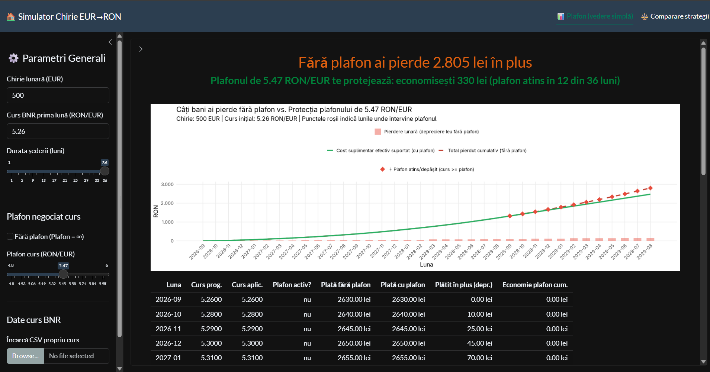
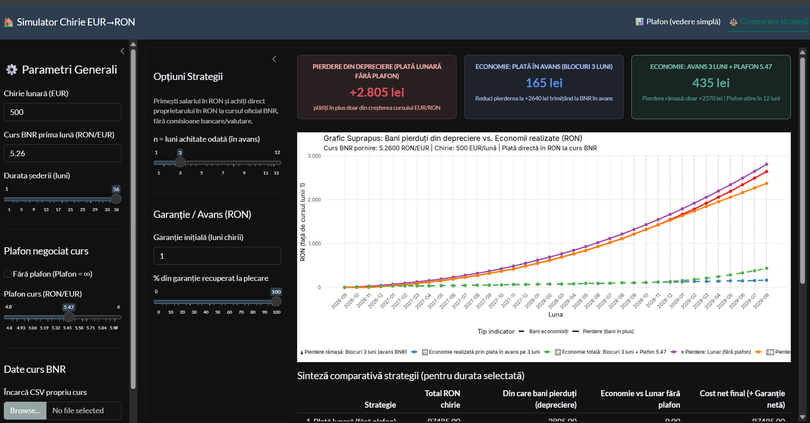

Usage:

Instalați [just](https://github.com/casey/just), și R cum vă place (eu îl am prin `mise`) căutați voi pe net lol
și doar

```bash
just
```

----------

Am văzut ca (cel puțin în Cluj) tot mai mulți prorietari cer chiria in EURO in contract (sau echivalent BNR, care trebuie recalculat în fiecare lună) și refuză sa aiba un pret fix in RON. Așa că m-am gândit la un tool să vă ajute să negociați mai bine niște clauze mai deștepte în contractele de închiere:
Posibilitatea plății în avans cu N luni (pentru a amortiza deprecierea)
și / sau cererea unui plafon (care mă gândesc că trebuie ales cât să nu dea prea tare la ochi)

Am pus-o pe Sonnetă să facă programu ăsta, care momentan se ruleaza doar local din R, dar poate îl hostez mai încolo pe undeva să vă fie mai ușor.

Implicit folosește ultimul curs EUR/RON publicat de BNR și prognozele trimestriale ING, preluate automat și păstrate în cache. Poți selecta și un CSV propriu sau seria statică existentă în proiect.

Screenshoturile arată economii simulate, condiționate de cursurile din CSV și de clauzele acceptate de proprietar.

Nu am explitat tot ce-i pe-acolo dar ar trebui să fie (sper) self-explanatory.

----------

### Slopuială scrisă de dânsu

# Simulator Chirie EUR→RON — Instrucțiuni

## Cerințe

- R (≥ 4.0)
- Pachete: `shiny`, `ggplot2`, `dplyr`, `scales`, `bslib`, `xml2`

## Instalare pachete (o singură dată)

```r
install.packages(c("shiny", "ggplot2", "dplyr", "scales", "bslib", "xml2"),
                 repos = "https://cloud.r-project.org")
```

## Pornire aplicație

```bash
# din directorul proiectului:
Rscript -e "shiny::runApp('.', port=7474, launch.browser=FALSE)"
```

Sau din R / Radian:

```r
shiny::runApp(".", port = 7474, launch.browser = FALSE)
```

Deschide în browser: **<http://127.0.0.1:7474**>

## Structura fișierelor

| Fișier | Rol |
|---|---|
| `app.R` | Interfața și serverul Shiny |
| `R/model.R` | Validarea CSV și formulele |
| `R/sources.R` | Surse BNR/ING, cache și estimarea cursurilor între repere |
| `tests/run.R`, `tests/sources.R` | Verificări de calcul, surse, cache și integrare Shiny |
| `date_curs.csv` | Scenariul static anterior, disponibil în modul offline |
| `README.md` | Acest fișier |

## Date live și prognoze

- **BNR & Istoric:** [fluxul XML oficial](https://curs.bnr.ro/nbrfxrates.xml) pentru cursul curent de azi, plus istoricul lunar oficial BNR inclus din ianuarie 2018 până în prezent (`R/bnr_history.csv`). Se poate simula începerea chiriei în trecut sau în viitor pe un timeline unificat.
- **ING:** [tabelul public de prognoze FX](https://think.ing.com/forecasts/), preluat din HTML. Integrarea citește EUR/RON și antetele trimestriale din secțiunea FX; nu presupune existența unui API public ING. O modificare incompatibilă a paginii produce o eroare explicită și, dacă există, folosirea cache-ului valid.
- ING publică repere de **sfârșit de trimestru**, nu cursuri BNR viitoare și nici o prognoză pentru fiecare lună. Aplicația estimează liniar, în funcție de numărul de zile, între cursul BNR disponibil azi și aceste repere.
- **Diferențiere clară în grafice și tabele:** Lunile viitoare (prognoze/estimări) sunt marcate vizual distinct prin zonă de fundal galbenă, linie de demarcație între istoric și viitor, inele portocalii pe puncte și etichete `🔮 Prognoză` vs `🏛️ BNR istoric (observat)`.
- Luna curentă înseamnă că șederea începe **azi**, în fusul `Europe/Bucharest`. Ratele următoare sunt estimate în aceeași zi a fiecărei luni, limitată la ultima zi a lunii când este necesar (31 ianuarie → 28/29 februarie → 31 martie). Pentru simulări în trecut sau lună viitoare, începerea este pe ziua 1.
- Durata maximă este dată de lunile disponibile până la ultimul reper ING. Nu se extrapolează după el.
- La verificarea din 17 septembrie 2026, pagina ING acoperea până la 31 decembrie 2027. Orizontul este citit din sursă, nu fixat în cod.
- O actualizare a prognozei poate schimba economiile în ambele sensuri; datele mai recente nu garantează o predicție mai precisă.

### Cache și actualizare

- Cache persistent în `tools::R_user_dir("calcule-chirii", "cache")`, în afara repository-ului; se reutilizează între sesiuni și reporniri.
- BNR: valabil o oră; ING: 24 de ore. Cu aplicația deschisă, expirarea se verifică la fiecare 5 minute. Schimbarea chiriei sau duratei nu declanșează descărcări noi.
- **Actualizează acum** ocolește termenul cache-ului și reîncarcă ambele surse.
- Se salvează numai răspunsurile validate, împreună cu URL-ul și momentul preluării. Un răspuns invalid nu suprascrie copia bună.
- Dacă actualizarea eșuează, o copie BNR de maximum 7 zile sau ING de maximum 30 de zile poate fi folosită, cu mesaj vizibil. În plus, cursul BNR trebuie să aibă o dată de publicare de cel mult 7 zile. Fără o copie acceptabilă, calculele live afișează eroarea; modurile CSV rămân disponibile.
- Interfața afișează separat data publicării BNR, eticheta de actualizare ING și ora ultimei preluări reușite. Verificarea paginii nu înseamnă că ING și-a revizuit prognoza.

### CSV

- Alege **CSV propriu** și încarcă `month,eur_ron` sau **CSV existent (offline)**.
- Seria existentă acoperă septembrie 2026 – august 2029. Documentația anterioară atribuia contradictoriu datele unor surse diferite; proveniența ei rămâne neverificată. Este un scenariu static, fără actualizare automată.
- În modurile CSV, și prima lună folosește exact cursul din fișier, fără înlocuire BNR.

## Excluderi explicite din model

- Dobânzi / randament pe sumele deținute
- Indexarea chiriei
- Fluctuații intra-lunare ale cursului
- Orice costuri comune tuturor variantelor (utilități, întreținere etc.)

## Note juridice

- Procentul de restituire a avansului este o **ipoteză economică configurabilă**, nu o concluzie juridică sau contractuală.

## Luna de început și interpretarea rezultatelor

- Selectorul afișează luni și ani, cu luna curentă implicită. Modul live folosește convenția de început de mai sus; modurile CSV folosesc rândul lunii alese.
- Durata se limitează la lunile rămase. CSV-ul trebuie să aibă luni consecutive și unice în format `AAAA-LL`, cu cursuri finite și strict pozitive; fișierele invalide afișează o eroare.
- Diferența față de luna 1 este **semnată**: costul chiriei minus costul la cursul inițial constant. Scăderile cursului compensează creșterile.
- Economia unei strategii este chiria lunară fără plafon minus chiria acelei strategii. O economie negativă înseamnă că strategia costă mai mult.
- Avansul blochează cursul la începutul fiecărui bloc; ultimul bloc acoperă doar lunile rămase. Graficele repartizează costul pe lunile acoperite, nu reprezintă calendarul transferurilor bancare.
- Garanția este calculată separat pentru fiecare strategie, cu sau fără plafon, și restituită în RON ca procent din suma inițială. Cardurile și graficele compară chiria; tabelul prezintă și garanția și economia netă finală.
- Calculele păstrează precizia internă și rotunjesc rezultatele afișate la bani; contractele care rotunjesc fiecare plată pot produce diferențe de câțiva bani.

## Verificare

Din directorul proiectului: `Rscript tests/run.R`.
Verificările acoperă cursuri crescătoare, descrescătoare și oscilante, plafon,
plată în avans, bloc final incomplet, garanții, CSV-uri invalide, selectarea lunii,
parsarea surselor, expirarea cache-ului, erorile de rețea și interpolarea. Testele sunt offline.

Verificarea manuală a surselor reale (necesită internet):

```bash
Rscript -e 'source("R/sources.R"); s <- load_live_sources(force=TRUE); print(build_live_rates(s, bucharest_today()))'
```
